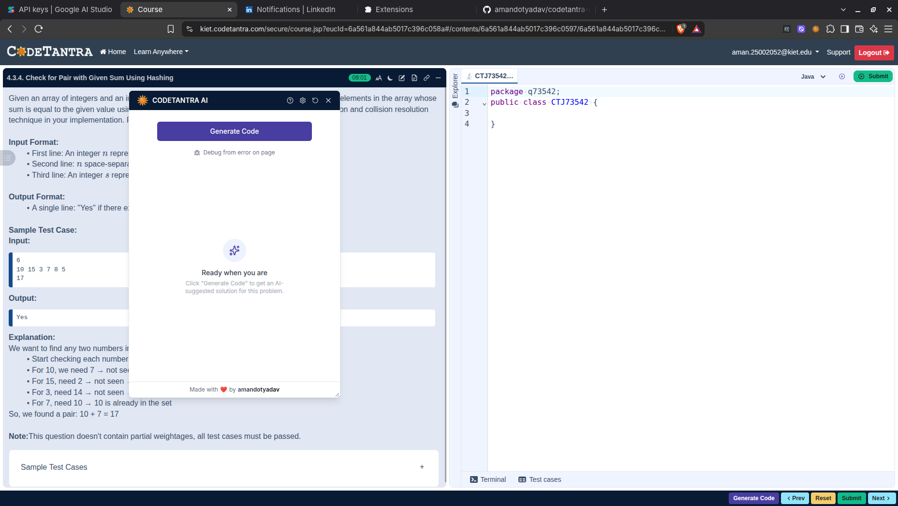
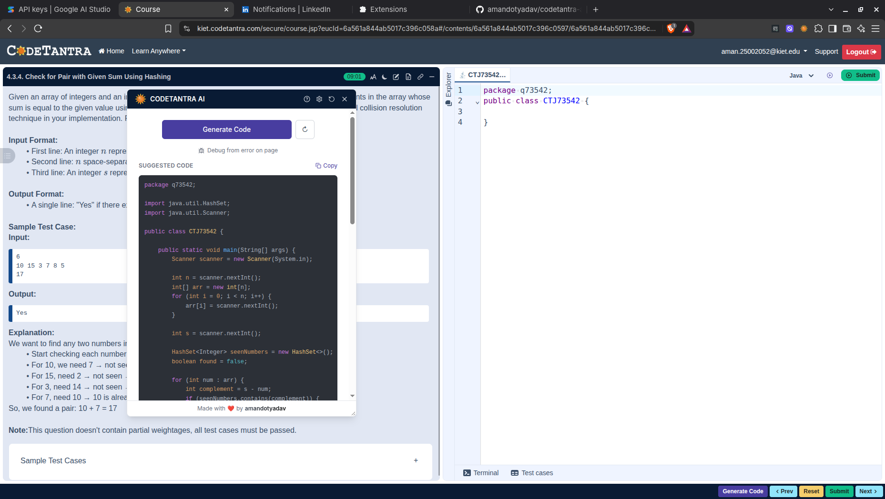
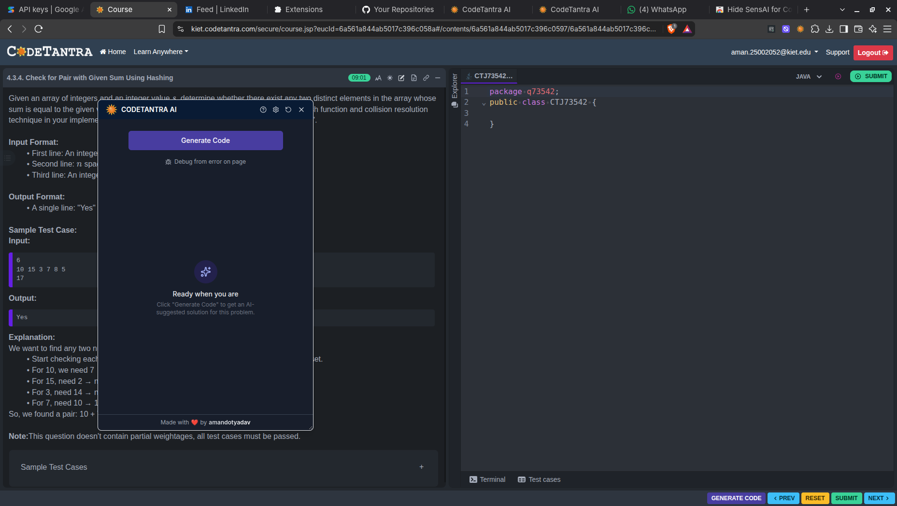
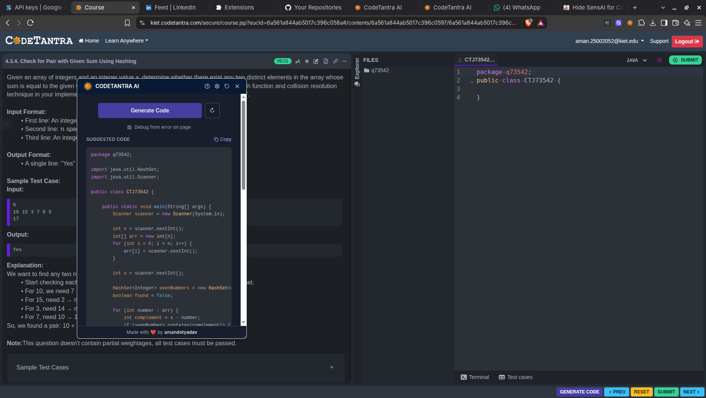
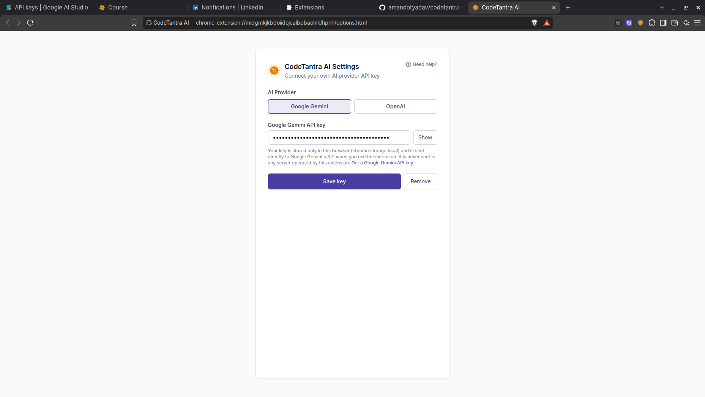
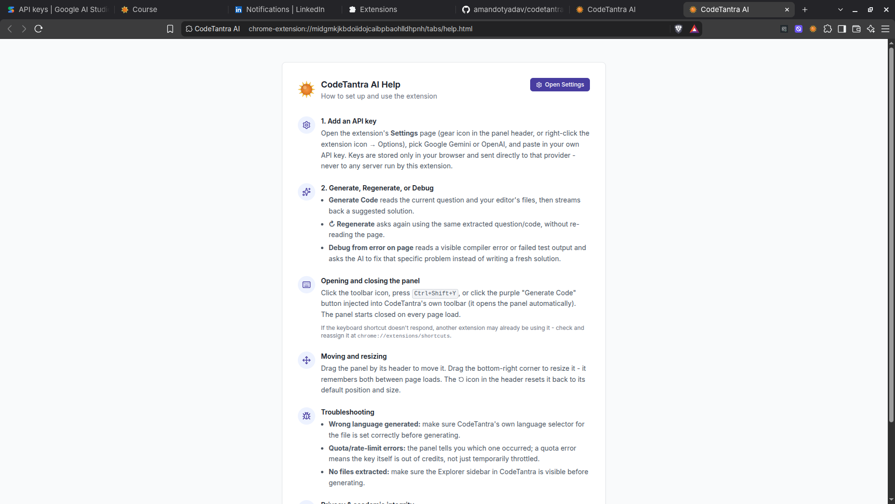

# CodeTantra AI — AI Coding Assistant Chrome Extension

[](./LICENSE)
[](https://developer.chrome.com/docs/extensions/mv3/intro/)
[](https://www.typescriptlang.org/)
[](https://react.dev/)
[](https://www.plasmo.com/)
[](#contributing)

**CodeTantra AI** is an open-source Manifest V3 Chrome extension that adds a
floating AI assistant panel to [CodeTantra](https://codetantra.com) exercise
pages. It reads the current question and your code, then streams back a
suggested solution, a plain-language explanation, and Big-O time/space
complexity — powered by **your own Google Gemini or OpenAI API key**, with
no extension-operated backend server in between.

> **Academic integrity note**: this tool can generate full solutions to
> CodeTantra exercises. Whether and how you use it is your responsibility —
> check your institution's academic integrity policy, and CodeTantra's own
> Terms of Use, before using it on graded work. This project is shared for
> personal, educational, and portfolio purposes.

---

## Table of contents

- [Features](#features)
- [How it works](#how-it-works)
- [Screenshots](#screenshots)
- [Installation](#installation)
- [How to use](#how-to-use)
- [Permissions explained](#permissions-explained)
- [Privacy](#privacy)
- [Architecture](#architecture)
- [Known limitations](#known-limitations)
- [Contributing](#contributing)
- [License](#license)
- [Author](#author)

---

## Features

- 🪟 **Floating, resizable, draggable panel** injected into CodeTantra
  problem pages, closed by default on every page load (toggle with the
  toolbar icon or `Ctrl+Shift+Y`), with a one-click reset back to its
  default position/size, and a light/dark theme that follows CodeTantra's
  own.
- 🧩 **Toolbar integration** — a "Generate Code" button is injected directly
  into CodeTantra's own toolbar (right before its "Prev" button), so you
  can trigger a generation without opening the panel first.
- 📄 **Context-aware extraction** of the current question, sample test
  cases, course name, detected programming language, and the code from
  every open file in the editor.
- 🔑 **Bring your own key** — choose Google Gemini or OpenAI, each using
  your own API key sent directly to that provider. No extension-operated
  backend server is involved.
- ⚡ **Live streaming** — the suggested code appears as it's generated,
  followed by an explanation and Big-O time/space complexity, with syntax
  highlighting matched to CodeTantra's own language selector.
- 🔁 **Regenerate** — re-asks the AI using the same extracted question and
  code, without re-scraping the page.
- 🐛 **Debug from error on page** — extracts a visible compiler error or
  failed test output and asks the AI to fix that specific problem, instead
  of writing a fresh solution from scratch.
- 📚 **Built-in Help page** and Settings page, both reachable from the
  panel header at any time.
- 🛡️ **Clear, actionable error states** (missing/invalid API key, exhausted
  quota vs. rate limiting, no question found, network failure) instead of
  silent failures.

## How it works

1. **Extraction** — a content script reads the question, sample test cases,
   course name, editor language, and code from every open file in
   CodeTantra's own DOM (see [`src/utils/extract.ts`](./src/utils/extract.ts)).
2. **Handoff to the background worker** — because content scripts run under
   the host page's Content Security Policy, the actual network call to
   Gemini or OpenAI happens in the **background service worker** instead,
   reached over a long-lived `chrome.runtime.connect` port rather than a
   single request/response message.
3. **Streaming, marker-delimited responses** — the LLM is asked to respond
   in plain text with literal section markers
   (`@@CT_AI_CODE@@`, `@@CT_AI_EXPLANATION@@`, ...) instead of JSON. JSON
   can't be usefully shown mid-stream — the code is escaped and interleaved
   with the rest of the object — while marker-delimited text can be sliced
   out of a growing buffer incrementally, which is what lets the code
   appear live as it's generated (see [`src/services/prompt.ts`](./src/services/prompt.ts)).
4. **Rendering** — the background worker pushes each chunk back over the
   port; the panel shows a live preview immediately, then the full
   explanation and complexity once the stream completes.

This design is what lets the same panel support two independently
streaming providers (Gemini and OpenAI) behind one small dispatcher
(see [`src/services/llm.ts`](./src/services/llm.ts)), without either the
UI or the prompt logic needing to know which one is active.

## Screenshots

| Panel on a CodeTantra exercise                                                       | Generated solution                                                                   |
| ------------------------------------------------------------------------------------ | ------------------------------------------------------------------------------------ |
|  |  |

| Panel in dark mode                                                                                 | Generated solution in dark mode                                                     |
| -------------------------------------------------------------------------------------------------- | ----------------------------------------------------------------------------------- |
|  |  |

| Settings page                                                                           | Help page                                            |
| --------------------------------------------------------------------------------------- | ---------------------------------------------------- |
|  |  |

## Installation

### Prerequisites

- Node.js 18+
- npm
- An API key from [Google AI Studio](https://aistudio.google.com/app/apikey)
  (Gemini) or [OpenAI](https://platform.openai.com/api-keys)

### Clone and build

```bash
git clone https://github.com/amandotyadav/codetantra-ai.git
cd codetantra-ai
npm install
npm run build
```

This produces a production build at `build/chrome-mv3-prod`.

### Load into Chrome

1. Go to `chrome://extensions`
2. Enable **Developer mode** (top right)
3. Click **Load unpacked** and select `build/chrome-mv3-prod`
   (or `build/chrome-mv3-dev` if you ran `npm run dev` instead)

### Development mode (hot reload)

```bash
npm run dev
```

Load the resulting `build/chrome-mv3-dev` folder the same way as above;
changes to the source will rebuild automatically.

## How to use

1. **Add an API key** — click the extension icon in Chrome's toolbar, then
   open **Settings** (gear icon in the panel header), pick Gemini or
   OpenAI, and paste in your key.
2. **Open a CodeTantra exercise page.**
3. **Open the panel** — click the toolbar icon, press `Ctrl+Shift+Y`, or
   click the purple **Generate Code** button injected into CodeTantra's
   own toolbar (this opens the panel automatically).
4. **Generate Code** — reads the question and your editor's files, then
   streams back a suggested solution, explanation, and complexity.
5. **Regenerate** (↻) — ask again using the same extracted context, without
   re-reading the page.
6. **Debug from error on page** — after a failed Run/Submit, ask the AI to
   fix the specific error shown instead of writing a fresh solution.
7. **Move, resize, or reset** the panel by dragging its header, dragging
   its bottom-right corner, or clicking the reset (↺) icon.

See the extension's built-in **Help** page (? icon in the panel header) for
more detail and troubleshooting tips.

## Permissions explained

| Permission                                                   | Why it's needed                                                                                                       |
| ------------------------------------------------------------ | --------------------------------------------------------------------------------------------------------------------- |
| `activeTab`                                                  | Lets the toolbar icon toggle the panel on the tab you're currently viewing, without needing broad access to all tabs. |
| `storage`                                                    | Stores your API key(s) locally (`chrome.storage.local`) so you only have to enter them once.                          |
| Host access to `*://*.codetantra.com/*`                      | The panel and question/code extraction only run on CodeTantra pages.                                                  |
| Host access to `https://generativelanguage.googleapis.com/*` | Required for the background service worker to call Gemini directly with your API key.                                 |
| Host access to `https://api.openai.com/*`                    | Required for the background service worker to call OpenAI directly with your API key.                                 |

The extension does **not** request `tabs`, `scripting`, `<all_urls>`, or any
permission beyond what's listed above.

## Privacy

See [`privacy-policy/PRIVACY.md`](./privacy-policy/PRIVACY.md) for the full
policy. In short:

- Your API key(s) are stored only in your browser (`chrome.storage.local`)
  and are never transmitted anywhere except directly to the provider you
  selected, as part of your own request.
- Question text, sample test cases, course name, and your code are sent
  directly from your browser to your chosen provider (Gemini or OpenAI)
  when you click "Generate Code". They are not sent to, or stored by, any
  server operated by this extension's author.
- No analytics, telemetry, or tracking of any kind is included.
- Your use of Gemini or OpenAI is subject to that provider's own terms:
  [Google's Gemini API terms](https://ai.google.dev/gemini-api/terms) or
  [OpenAI's terms of use](https://openai.com/policies/terms-of-use).

## Architecture

Built with [Plasmo](https://docs.plasmo.com/), a Manifest V3 framework for
Chrome extensions, React 18, TypeScript, and Tailwind CSS.

```
codetantra-ai/
├── src/
│   ├── background.ts               # Service worker: icon/shortcut toggle, LLM API calls
│   ├── options.tsx                 # Options page: provider selection + API key management
│   ├── tabs/
│   │   └── help.tsx                # Standalone Help page (opened in a new tab)
│   ├── contents/
│   │   └── CodetantraWindow.tsx    # Content script: injects the draggable panel (codetantra.com only)
│   ├── components/codetantra/      # Panel UI components
│   ├── services/
│   │   ├── llm.ts                  # Dispatches to gemini.ts or openai.ts based on the selected provider
│   │   ├── gemini.ts               # Gemini streaming REST API client
│   │   ├── openai.ts               # OpenAI streaming REST API client
│   │   ├── sse.ts                  # Shared Server-Sent-Events reader used by both clients
│   │   ├── prompt.ts               # Shared prompt construction + streaming-friendly response parsing
│   │   ├── storage.ts              # chrome.storage.local wrapper for provider + API keys
│   │   ├── messages.ts             # Typed content-script <-> background port/message protocol
│   │   └── errors.ts               # Typed errors + user-facing messages
│   ├── utils/
│   │   ├── extract.ts              # DOM extraction from the CodeTantra editor
│   │   ├── injectGenerateButton.ts # Injects "Generate Code" into CodeTantra's own toolbar
│   │   ├── theme.ts                # Detects/watches CodeTantra's light/dark theme
│   │   ├── highlight.ts            # highlight.js wrapper (language-aware, VS Code-style theme)
│   │   ├── languages.ts            # Shared language id list used by extract.ts and highlight.ts
│   │   ├── safeRuntime.ts          # Guards against "extension context invalidated" crashes
│   │   └── cleanText.ts
│   └── tests/                      # vitest unit tests
├── assets/                         # Extension icon
├── privacy-policy/                 # Privacy policy source
└── vitest.config.ts
```

Key design decisions:

- The actual LLM network call happens in the **background service
  worker**, not the content script, since the content script runs under
  the host page's Content Security Policy.
- Generation streams over a **long-lived port**
  (`chrome.runtime.connect`/`onConnect`) rather than a single
  request/response message, so the background worker can push each chunk
  of text to the panel as it arrives.
- The LLM responds in **plain text with section markers** instead of JSON,
  which is what makes live-streaming the code cleanly possible (see
  [How it works](#how-it-works) above).
- DOM extraction and toolbar injection are written defensively — idempotent
  where CodeTantra's own UI can toggle (e.g. the Explorer sidebar), and
  falling back gracefully (e.g. language auto-detection) when a selector
  doesn't match.

## Known limitations

- DOM extraction (question text, test cases, files) relies on CodeTantra's
  current markup (Quill editor `.ql-editor`, CodeMirror `.cm-content`,
  etc.). If CodeTantra changes its UI significantly, extraction may stop
  working until selectors are updated.
- Multi-file extraction opens the file explorer and clicks through files
  automatically; on slow connections this can take a few seconds per file.
- Requires the user to bring their own Gemini or OpenAI API key; there is
  no bundled or shared key.
- Not published to the Chrome Web Store — see the note on CodeTantra's own
  Terms of Use below.

> **A note on distribution**: CodeTantra's Terms of Use prohibit automated
> extraction/scraping of their platform. This project reads data from
> CodeTantra's pages to function, so it is shared here as source code for
> personal use, learning, and portfolio purposes only, and is intentionally
> **not published on the Chrome Web Store**. Use it at your own discretion
> and risk.

## Contributing

Issues and pull requests are welcome. Please run the checks below before
submitting a PR:

```bash
npm run lint   # typecheck + format check
npm test        # vitest unit tests
```

## License

[MIT](./LICENSE) © amandotyadav

## Author

**Aman Yadav**

- GitHub: [@amandotyadav](https://github.com/amandotyadav)
- LinkedIn: [amandotyadav](https://www.linkedin.com/in/amandotyadav/)

If you found this project useful or interesting, a ⭐ on the repo is
appreciated!
